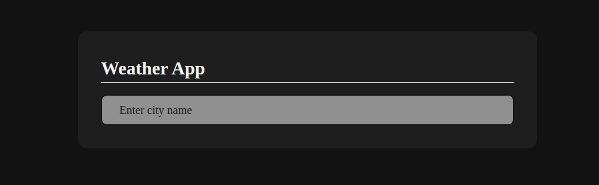
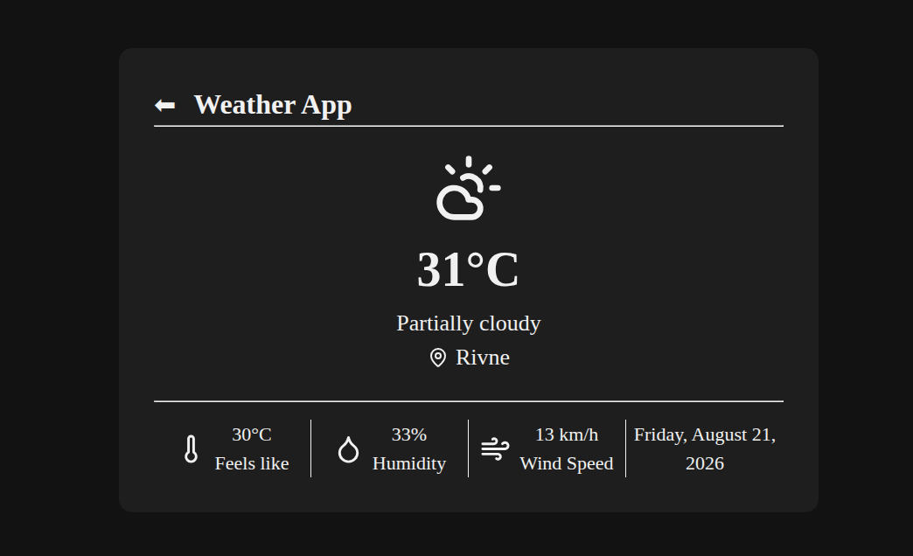

# 🌤️ Weather App

A vanilla JavaScript weather app that fetches real-time weather data for any location using the Visual Crossing API, displaying temperature, feels like, humidity, wind speed, and current conditions with matching icons.

Built as part of [The Odin Project](https://www.theodinproject.com/) curriculum.

**[Live Demo](https://andrii-sydorchuk.github.io/TOP-weatherApp/)**

## Screenshots

**Home**


**Weather info**


## Features

- Search weather by any city or location name (press Enter to submit)
- Displays temperature, feels like, humidity, wind speed, and weather condition
- Weather condition icons mapped from Visual Crossing API data to Lucide icons
- Loading indicator while fetching data
- Error feedback on invalid or failed location lookup
- Formatted date display using date-fns

## Tech Stack

- **Vanilla JavaScript** — app logic and DOM manipulation
- **Webpack** — bundling and dev server
- **Visual Crossing API** — weather data (metric units)
- **Lucide** — weather condition and UI icons
- **date-fns** — date formatting
- **CSS** — styling with CSS custom properties
- **GitHub Actions** — automated build and deployment to GitHub Pages

## Project Structure

```
src/
├── index.js              # entry point
├── index.html            # page markup
├── style.css             # styles with CSS custom properties
├── app.js                # app coordinator — search flow and event binding
├── apiService.js         # Visual Crossing API requests
├── weatherFormatter.js   # normalises raw API response into display-ready data
├── domManager.js         # DOM rendering, view switching, loading/error states
├── iconsMap.js           # maps API condition strings to Lucide icon components
└── dateFormatter.js      # date formatting helpers via date-fns
```

## Technical Notes

- Two-view layout: home (search input) and info (results), toggled with a `.hidden` CSS class
- Raw API data is normalised in `weatherFormatter` before reaching the DOM layer, keeping rendering logic free of API concerns
- Visual Crossing condition strings are mapped to Lucide icon components via a lookup table in `iconsMap.js`
- UI icons (location pin, thermometer, droplet, wind) are created dynamically via Lucide's `createElement` on init
- API key stored in a `.env` file and injected at build time via `dotenv-webpack`
- Error and loading states have dedicated DOM components with explicit show/hide logic

## Getting Started

```bash
git clone https://github.com/AndriySydorchuk/TOP-weatherApp.git
cd TOP-weatherApp
npm install
```

Create a `.env` file based on `.env.example` and add your [Visual Crossing API key](https://www.visualcrossing.com/):

```bash
cp .env.example .env
```

Run the dev server:

```bash
npm start
```

Other scripts:

```bash
npm run build    # production build
```

## Acknowledgements

Weather data provided by the [Visual Crossing API](https://www.visualcrossing.com/). Built as a project for [The Odin Project](https://www.theodinproject.com/).
